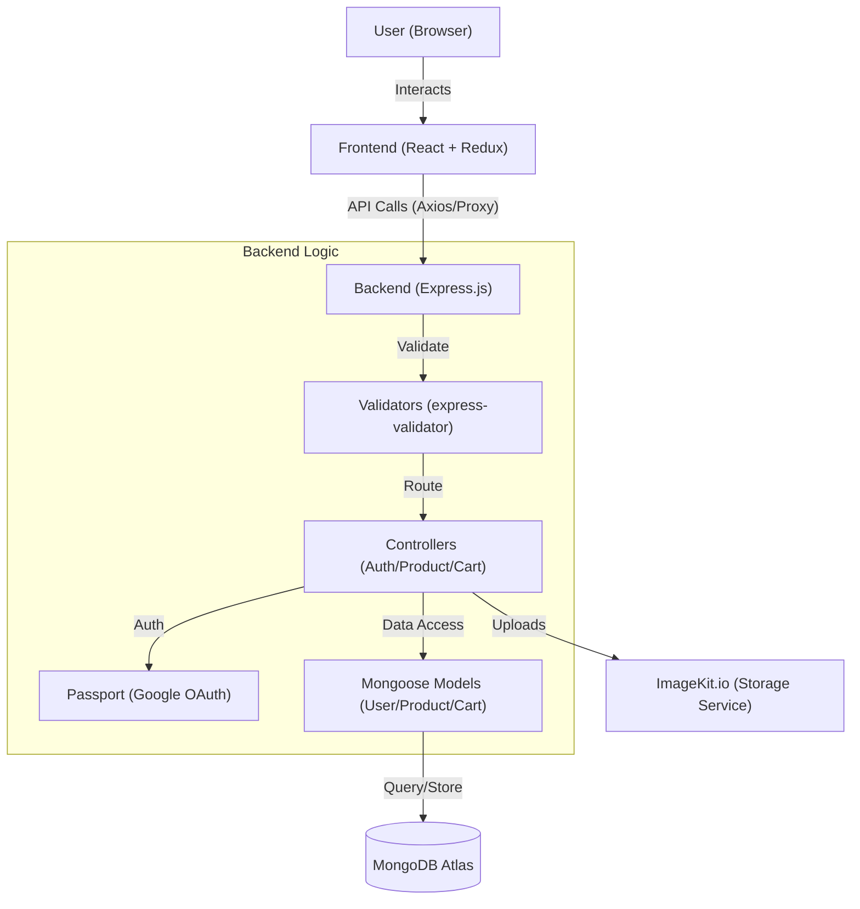

#FashionKart
FashionKart is a full-stack e-commerce marketplace where users register as either a **buyer** or a **seller** to interact with a shared product catalog. Sellers can list products (with images and variants) through a dedicated dashboard, while buyers can browse products and manage a shopping cart.

The project is split into two decoupled apps:

- **Backend** — Node.js + Express REST API, MongoDB (Mongoose), JWT + Google OAuth authentication, image uploads via ImageKit.
- **Frontend** — React (v19) + Vite, Redux Toolkit for state, Tailwind CSS for styling.

---

## Tech Stack

**Backend:** Node.js, Express 5, MongoDB/Mongoose, Passport.js (Google OAuth 2.0), JWT, Bcrypt, Multer, ImageKit, Morgan

**Frontend:** React 19, Vite, Redux Toolkit, React Router, Tailwind CSS 4, Lucide React, React Hot Toast

---

## Architecture



**Request flow:** `routes/` → `validator/` (express-validator) → `middleware/` (auth checks) → `controller/` → `models/` (Mongoose) → MongoDB.

### Authentication

- **Local auth** — passwords are hashed with `bcrypt` via a `pre("save")` hook on the User model.
- **Google OAuth** — implemented with `passport` + `passport-google-oauth20`, initialized in `backend/src/app.js`.
- **Sessions** — stateless, JWT stored in an HTTP-only cookie. Two middleware guards enforce access:
  - `authenticateUser` — any logged-in user
  - `authenticateSeller` — logged-in **and** `role === "seller"`

### Role-Based Access

Users have a `role` field (`buyer` or `seller`) on the User model. Seller-only routes (creating products, viewing seller dashboard data) are protected by `authenticateSeller`.

---

## Repository Structure

```
Velix/
├── backend/
│   ├── server.js
│   └── src/
│       ├── app.js
│       ├── config/
│       │   ├── config.js
│       │   └── db.js
│       ├── controller/
│       │   ├── auth.controller.js
│       │   ├── cart.controller.js
│       │   └── product.controller.js
│       ├── middleware/
│       │   └── auth.middleware.js
│       ├── models/
│       │   ├── cart.model.js
│       │   ├── product.model.js
│       │   └── user.model.js
│       ├── routes/
│       │   ├── auth.routes.js
│       │   ├── cart.routes.js
│       │   └── product.routes.js
│       └── validator/
│           ├── auth.validator.js
│           ├── cart.validator.js
│           └── product.validator.js
└── frontend/
    ├── src/
    │   ├── app/
    │   │   ├── App.jsx
    │   │   ├── app.routes.jsx
    │   │   └── app.store.js
    │   ├── features/
    │   │   ├── auth/
    │   │   ├── cart/
    │   │   └── product/
    │   └── main.jsx
    ├── tailwind.config.js
    ├── vite.config.js
    └── package.json
```

> Note: despite being organized by feature, the backend does **not** have a separate service or DAO layer — controllers talk to Mongoose models directly.

---

## API Reference

All routes are also mounted under `/api/v1/auth` in addition to `/api/auth` (both work, kept for backwards compatibility during development).

### Auth — `/api/auth`

| Method | Endpoint            | Access  | Description                     |
|--------|---------------------|---------|----------------------------------|
| POST   | `/register`          | Public  | Register a new buyer or seller  |
| POST   | `/login`             | Public  | Log in, sets JWT cookie          |
| GET    | `/me`                | Private | Get the current user's profile   |
| GET    | `/google/`           | Public  | Start Google OAuth flow          |
| GET    | `/google/callback`   | Public  | Google OAuth callback            |

### Products — `/api/products`

| Method | Endpoint                        | Access         | Description                          |
|--------|----------------------------------|----------------|----------------------------------------|
| GET    | `/`                              | Public         | List all products                     |
| GET    | `/detail/:id`                    | Public         | Get a single product's details        |
| GET    | `/seller`                        | Seller only    | List the current seller's products    |
| POST   | `/`                               | Seller only    | Create a product (up to 7 images)     |
| POST   | `/:productId/variants`           | Seller only    | Add a variant to an existing product  |

### Cart — `/api/cart` (all routes require login)

| Method | Endpoint                                          | Description                  |
|--------|----------------------------------------------------|-------------------------------|
| GET    | `/`                                                 | Get the current user's cart  |
| POST   | `/add/:productId/:variantId`                        | Add an item to the cart      |
| PATCH  | `/quantity/increment/:productId/:variantId`         | Increase item quantity        |
| PATCH  | `/quantity/decrement/:productId/:variantId`         | Decrease item quantity        |
| DELETE | `/remove/:productId/:variantId`                     | Remove an item from the cart |

---

## Getting Started

### Prerequisites

- Node.js (v18+ recommended)
- A MongoDB connection (local instance or MongoDB Atlas)
- A Google Cloud project with OAuth 2.0 credentials
- An ImageKit account (for image uploads)

### 1. Backend Setup

```bash
cd backend
npm install
```

Create a `.env` file in `backend/` with the following variables:

```env
MONGO_URI=your_mongodb_connection_string
JWT_SECRET=your_jwt_secret
GOOGLE_CLIENT_ID=your_google_client_id
GOOGLE_CLIENT_SECRET=your_google_client_secret
IMAGEKIT_PRIVATE_KEY=your_imagekit_private_key
NODE_ENV=development
```

Start the backend:

```bash
npm run dev
```

The server runs at `http://localhost:3000` by default.

### 2. Frontend Setup

```bash
cd frontend
npm install
npm run dev
```

The frontend dev server proxies `/api` requests to `http://localhost:3000` (configured in `frontend/vite.config.js`), so make sure the backend is running first.

### 3. Database

Make sure your MongoDB instance is reachable — either whitelist your IP in MongoDB Atlas, or have a local `mongod` instance running before starting the backend.

---

## Known Limitations

- No automated test suite yet.
- CORS handling in `backend/src/app.js` is currently commented out (the frontend relies on the Vite dev proxy instead) — if you deploy frontend and backend separately, you'll need to configure CORS explicitly.
- No `.env.example` file is included; use the variable list above as a template.


DEMO:

https://github.com/user-attachments/assets/5da4a008-494f-4031-9c81-43e28140c5c3

PREVIEW:


